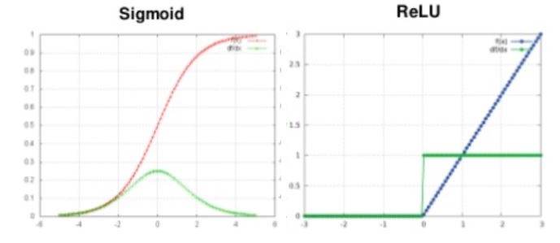
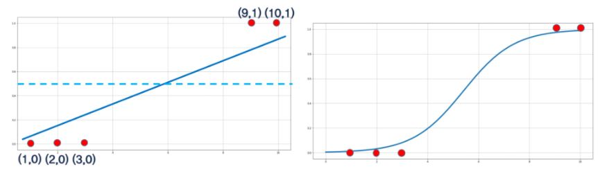
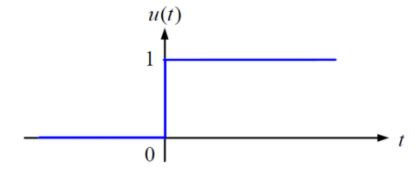
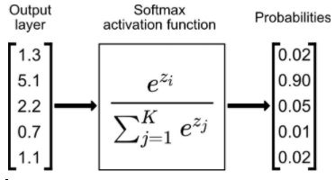
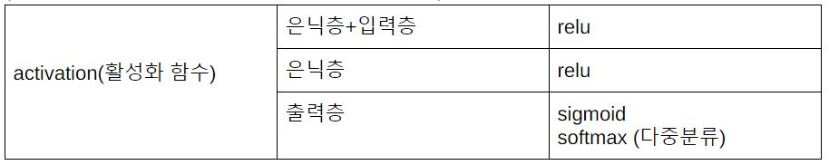

## 모두의 딥러닝

\# 최적화 방법(optimizer) 교재 p.124

확률적경사하강법(SGD)

모멘텀

네스테로프 모멘텀

아다그라드

알엠에스프롭

아담

\# **은닉층**에 **relu**를 쓰는 이유 :

오차 역전파의 경우, 시그모이드 함수를 쓰면 미분 시에 기울기 최대값이
0.3이고, 은닉층을 여러 겹 지나다 보면 기울기 소실 문제가 발생한다. 그
대안으로 찾은 것이 relu. relu는 미분하면 x\>0일 때, 기울기가 1으로
일정하므로 relu를 은닉층에 쓰면 기울기가 끝까지 남아 있게 되어, 기울기
소실 문제로부터 해방

\# 활성화함수로 sigmoid를 쓰는 이유 :

(수학적) 선형함수의 경우 층을 아무리 깊게 하더라도 또 다른 하나의 선형
함수로 표현할 수 있고, 은닉층이 의미가 없어지므로 비선형함수를 사용해야
한다.

ex) f(x) = c \* x

f(f(f(x))) = c \* c \* c \* x = C \* x

(비수학적)선형 함수를 활성화 함수로 이용하면 섬세하게 True와 False를
분류 못해서 비선형인 sigmoid를 채택

(수학적) 선형함수를 사용할 경우, 새로운 입력값과 회귀선과의 오차가 클
경우 입력값에 의해 예측 결과가 큰 영향을 받는 문제가 발생하고,
sigmoid함수를 사용하면 해결할 수 있다.

(비수학적)계단함수는 x=0에서 불연속이고 미분불가능하므로 sigmoid를 씀

\# **다중분류**(iris)의 **출력층**에는 **소프트맥스**를 쓰는 이유 :

합이 1이 되는 (ex. y\[0\]=0.1, y\[1\]=0.2, y\[2\]=0.7) 여러 개의
출력으로 표현할 수 있음

**\# 손실함수(Loss Function)** 종류

-   **평균 제곱 오차(MSE)** : 회귀(regression)으로 결과를 **예측**하고자
    > 할 때, 사용

-   **교차엔트로피(Cross Entrophy Error)** : 평균제곱오차와는 달리 오직
    > 실제 정답과의 오차만을 파악하는 손실함수이다(수식참고). 실제값이
    > 원핫 인코딩일 때, 0일 경우 y의 값이 무시되기 때문이다. **분류**
    > 문제에서 accuracy가 평균제곱오차(MSE)보다 정확하게 나온다.

\# 모델의 설정 p.131

**model = Sequential()**

**model.add(Dense(노드의 수, input_dim=독립변수의 개수,
activation=활성화 함수)**

(input_dim은 입력층에만 씀)

(첫번째 층은 은닉층이면서 입력층의 역할도 한다)

**\# model.compile(loss=손실함수,**

**optimizer=최적화방법,**

**metrics=측정항목함수)**

\*\*손실함수와 측정항목함수의 차이

측정항목을 평가한 결과는 모델을 학습(오차역전파)시키는 데 사용되지 않음

\*\*최적화방법 p.124

**\# model.fit(X_train, Y_train, epochs=반복횟수, batch_size=한번에
입력되는 데이터 수)**

\*\*배치 처리는 컴퓨터 연산 시에 데이터 전송 I/O의 병목현상을 줄여주고,
연산 시간을 단축해준다. batch_size가 증가할수록 컴퓨터 연산 속도 증가.
I/O 전송시간만 단축해주고, 순수 CPU와 GPU 연산시간만 남게 되므로, 연산
속도 증가에 한계는 있음.

\# k겹 교차 검증 p.175
n_fold = k
skf = StratifiedKFold(n_splits=n_fold, shuffle=True, random_state=seed)

\# ModelCheckpoint - 모델 저장
checkpointer = ModelCheckpoint(filepath=modelpath, monitor=손실함수, verbose=1, save_best_only=True)
verbose= 0, 1, 2
0: 과정 생략
1: 과정을 보여줌
save_best_only=True
앞서 저장한 모델보다 나아졌을 때만 저장

\# EarlyStopping - 학습의 자동 중단
early_stopping_callback = EarlyStopping(monitor=손실함수, patience=100)
model.fit(X, Y, validation_split= , epochs= , batch_size= , callbacks=[early_stopping_callback])
monitor=중단 기준(손실함수)
patience= 횟수 반복 동안 개선 없으면 중단

\# history에는 4개의 값이 존재
      학습셋 사용
loss : 훈련 손실값
acc : 훈련 정확도
      테스트셋 사용
val_loss : 검증 손실값
val_acc : 검증 정확도
y_loss = history.history[‘loss’]
y_vloss = history.history[‘val_loss’]

\# .flatten() : 데이터 배열을 몇 차원이든 모두 1차원으로 바꿔 읽기 쉽게 해 줌

\# .to_categorical(클래스, 클래스의 개수) - 0 또는 1로만 이루어진 원-핫 인코딩 변환
Y_train = np_utils.to_categorical(Y_class_train, 10)

\# 컨볼루션 층 추가 Conv2D()
model.add(Conv2D(노드수, kernel_size=(행, 열), input_shape=(행, 열, 색상(3) 또는 흑백(1)), activation=’relu’)
kernel_size : 커널(필터)의 크기를 행, 열로 정해줌
input_shape : 입력 데이터의 크기를 행, 열로 정하고, 
3번째 숫자가 색상이면 3, 흑백이면 1
2차원 배열이므로 Flatten() 함수로 1차원으로 바꿔줘야 함

\# 맥스 풀링 - 정해진 구역 안에서 최댓값 뽑아냄. 크기를 축소시키는 효과가 있음
model.add(MaxPooling2D(pool_size=2))
pool_size를 2로 정하면 전체 크기가 절반으로 줄어듦
2차원 배열이므로 Flatten() 함수로 1차원으로 바꿔줘야 함

\# 과적합 방지법
train set, test set split
EarlyStopping - 학습의 자동 중단
Drop Out  p.233
가중치 조정

\# text_to_word_sequence(text) - 문장을 단어 단위로 나눔

p.245
\# Bag-of-Words (단어의 가방, 전처리 방법) - 각 가방에 몇 개의 단어가 있는 지 빈도수 체크
토큰(token) : 문법적으로 더이상 나눌 수 없는 언어요소

token = Tokenizer()		# 토큰화 함수 지정
token.fit_on_text(text)	# 토큰화 함수에 문장 적용
print(token.word_counts)	# 단어의 빈도 수를 계산한 결과 출력
print(token.document_count)	# 총 몇 개의 문장이 들어있는지 출력
print(token.word_docs)	# 각 단어들이 몇 개의 문장에 나오는가를 출력
print(token.word_index)	# 각 단어에 매겨진 인덱스 값을 출력

p.250
\# 단어의 원-핫 인코딩
x = token.texts_to_sequences([text])	# 토큰의 인덱스로만 채워진 새로운 배열을 만듦
word_size = len(token.word_index) + 1	# 배열 맨 앞에 0이 추가되므로 1이 더 많게 잡음
x = to_categorical(x, num_classes=word_size)	# 원-핫 인코딩

\# 단어 임베딩(word embedding) - 주어진 배열을 정해진 길이로 압축시킴
공간의 낭비가 적음 (각 단어 간의 유사도를 계산했기 때문)
단어 간 유사도
model = Sequential()
model.add(Embedding(입력될 총 단어 수, 임베딩 후 출력되는 벡터 크기, 
input_length=패딩 후 입력될 단어의 길이))

\# 유사도 식

\# 패딩(padding) - 서로 다른 길이의 데이터를 똑같이 맞춰 주는 작업
padded_x = pad_sequences(배열, 최대 길이)
